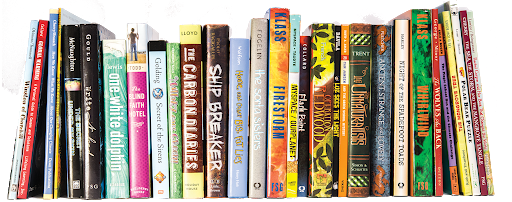

# GreatReads



This project was made for course Internet Applications Programming at School of Electrical Engineering, University of Belgrade. GreatReads is a web application similar to GoodReads.

## How to start

* Initilaize database by running sql script GreatReadsDB.sql
* In frontend/GreatReads directory:
```
ng serve --open
```
* In backend directory:
```
npm start
```
